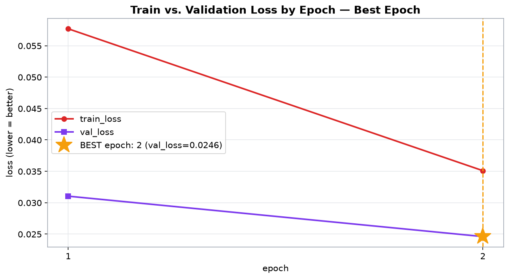
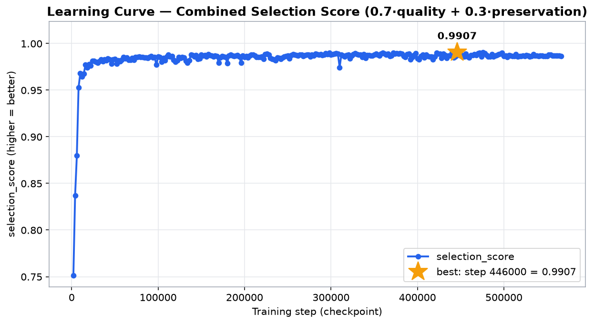
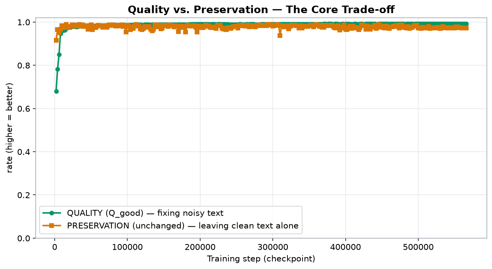
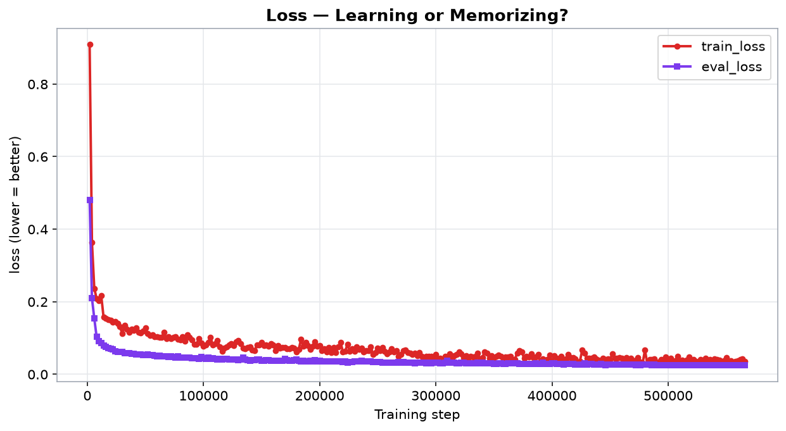
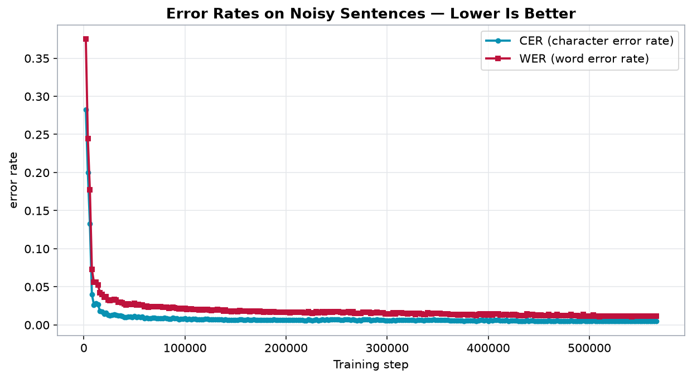
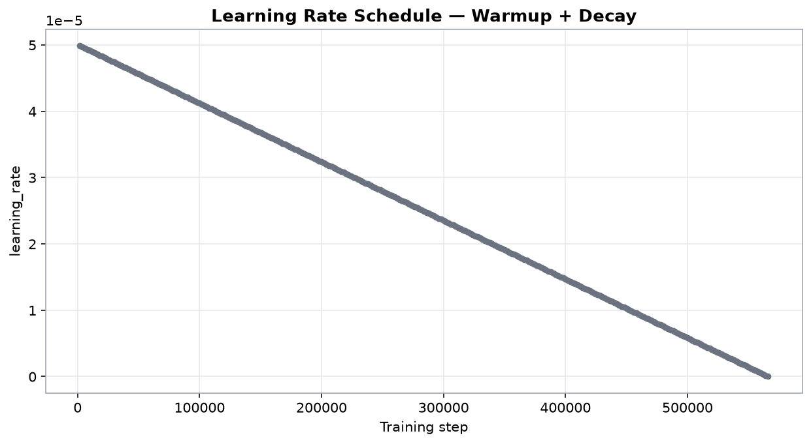
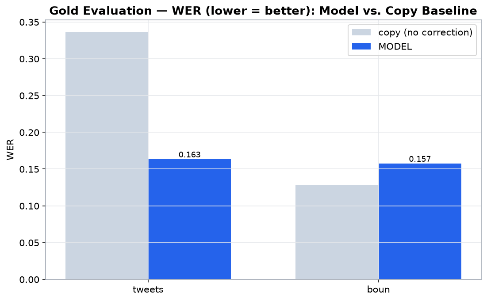
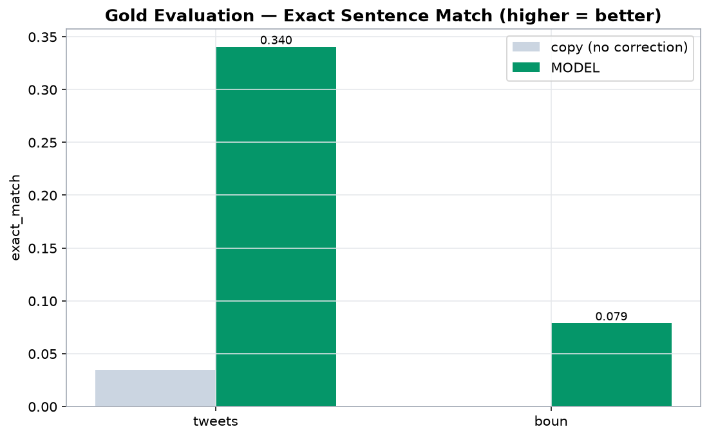

# Training Report — BERTurk2BERTurk Turkish Normalizer

## Summary

| field | value |
| --- | --- |
| Model | dbmdz/bert-base-turkish-cased |
| Device | cuda |
| Date | 2026-09-10 09:58:18 |
| Eval noisy (quality) | 3000 |
| Eval clean (preservation) | 3000 |
| Batch | 16 |
| Epoch | 2.0 |
| Learning rate | 5e-05 |
| Seed | 42 |
| Selection weight w (quality) | 0.7 |
| Total steps | 566026 |
| Total duration (min) | 1423.02 |

## Charts

### Train vs. val loss by epoch (best epoch)

### Learning curve (selection score)

### Quality vs. preservation trade-off

### Loss (per step, train vs. eval)

### CER & WER

### Learning rate schedule

### Gold evaluation — WER (model vs. copy)

### Gold evaluation — exact match (model vs. copy)

## Top 3 Checkpoints

| rank | step | selection_score |
| --- | --- | --- |
| 1 | 446000 | 0.9907 |
| 2 | 476000 | 0.9905 |
| 3 | 498000 | 0.9901 |

## All Checkpoints

> ★ = top 3 checkpoints by combined selection score

| ★ | step | epoch | examples | train_loss | eval_loss | CER | WER | Q_good | unchanged | selection |
| --- | --- | --- | --- | --- | --- | --- | --- | --- | --- | --- |
|  | 2000 | 0.0071 | 32000 | 0.9091 | 0.48081502318382263 | 0.2822 | 0.3751 | 0.6806 | 0.9156 | 0.7511 |
|  | 4000 | 0.0141 | 64000 | 0.3639 | 0.2094675749540329 | 0.1996 | 0.2445 | 0.7824 | 0.9647 | 0.8371 |
|  | 6000 | 0.0212 | 96000 | 0.2369 | 0.15414953231811523 | 0.133 | 0.1775 | 0.8492 | 0.9509 | 0.8797 |
|  | 8000 | 0.0283 | 128000 | 0.2085 | 0.10330633819103241 | 0.04 | 0.0728 | 0.9469 | 0.9669 | 0.9529 |
|  | 10000 | 0.0353 | 160000 | 0.2032 | 0.0907633900642395 | 0.0262 | 0.0559 | 0.9619 | 0.983 | 0.9682 |
|  | 12000 | 0.0424 | 192000 | 0.2165 | 0.08559593558311462 | 0.0285 | 0.0563 | 0.9604 | 0.9737 | 0.9644 |
|  | 14000 | 0.0495 | 224000 | 0.1571 | 0.07949052006006241 | 0.0267 | 0.0525 | 0.963 | 0.9779 | 0.9674 |
|  | 16000 | 0.0565 | 256000 | 0.1537 | 0.07557674497365952 | 0.018 | 0.0423 | 0.9723 | 0.9888 | 0.9772 |
|  | 18000 | 0.0636 | 288000 | 0.1511 | 0.07227597385644913 | 0.0173 | 0.0401 | 0.9736 | 0.9753 | 0.9741 |
|  | 20000 | 0.0707 | 320000 | 0.149 | 0.07037597894668579 | 0.0141 | 0.0363 | 0.977 | 0.9795 | 0.9778 |
|  | 22000 | 0.0777 | 352000 | 0.1434 | 0.06925111263990402 | 0.016 | 0.0372 | 0.9755 | 0.9788 | 0.9765 |
|  | 24000 | 0.0848 | 384000 | 0.1445 | 0.06410905718803406 | 0.0129 | 0.0328 | 0.9791 | 0.9865 | 0.9813 |
|  | 26000 | 0.0919 | 416000 | 0.14 | 0.06149524077773094 | 0.0125 | 0.0322 | 0.9796 | 0.9862 | 0.9816 |
|  | 28000 | 0.0989 | 448000 | 0.1321 | 0.06132170557975769 | 0.0131 | 0.0326 | 0.9791 | 0.9827 | 0.9802 |
|  | 30000 | 0.106 | 480000 | 0.1124 | 0.06152566522359848 | 0.0134 | 0.0337 | 0.9785 | 0.982 | 0.9795 |
|  | 32000 | 0.1131 | 512000 | 0.134 | 0.057740598917007446 | 0.0131 | 0.0323 | 0.9792 | 0.9849 | 0.9809 |
|  | 34000 | 0.1201 | 544000 | 0.1237 | 0.05768553540110588 | 0.0118 | 0.03 | 0.9809 | 0.9881 | 0.9831 |
|  | 36000 | 0.1272 | 576000 | 0.1155 | 0.05756109207868576 | 0.0119 | 0.03 | 0.9808 | 0.9807 | 0.9808 |
|  | 38000 | 0.1343 | 608000 | 0.1242 | 0.05657825618982315 | 0.0111 | 0.0293 | 0.9816 | 0.9862 | 0.983 |
|  | 40000 | 0.1413 | 640000 | 0.1206 | 0.055584900081157684 | 0.0102 | 0.0277 | 0.9828 | 0.9804 | 0.9821 |
|  | 42000 | 0.1484 | 672000 | 0.1275 | 0.05396267771720886 | 0.0097 | 0.0259 | 0.9838 | 0.9833 | 0.9837 |
|  | 44000 | 0.1555 | 704000 | 0.116 | 0.05390366539359093 | 0.0104 | 0.0272 | 0.9828 | 0.9833 | 0.983 |
|  | 46000 | 0.1625 | 736000 | 0.1133 | 0.05515878647565842 | 0.0107 | 0.0264 | 0.983 | 0.9673 | 0.9783 |
|  | 48000 | 0.1696 | 768000 | 0.1189 | 0.05235736072063446 | 0.0102 | 0.027 | 0.9831 | 0.9823 | 0.9829 |
|  | 50000 | 0.1767 | 800000 | 0.1272 | 0.052286263555288315 | 0.0113 | 0.0283 | 0.9819 | 0.9865 | 0.9833 |
|  | 52000 | 0.1837 | 832000 | 0.1124 | 0.053947813808918 | 0.0096 | 0.0258 | 0.9839 | 0.965 | 0.9782 |
|  | 54000 | 0.1908 | 864000 | 0.1072 | 0.05288511514663696 | 0.0109 | 0.027 | 0.9827 | 0.9798 | 0.9818 |
|  | 56000 | 0.1979 | 896000 | 0.1088 | 0.05326192080974579 | 0.0097 | 0.0263 | 0.9837 | 0.9743 | 0.9809 |
|  | 58000 | 0.2049 | 928000 | 0.1036 | 0.05047876015305519 | 0.0106 | 0.0263 | 0.9831 | 0.9801 | 0.9822 |
|  | 60000 | 0.212 | 960000 | 0.1041 | 0.04868138208985329 | 0.0087 | 0.0237 | 0.9853 | 0.9852 | 0.9853 |
|  | 62000 | 0.2191 | 992000 | 0.1022 | 0.05053425952792168 | 0.009 | 0.0247 | 0.9847 | 0.9823 | 0.984 |
|  | 64000 | 0.2261 | 1024000 | 0.102 | 0.049253955483436584 | 0.0082 | 0.0234 | 0.9857 | 0.9823 | 0.9847 |
|  | 66000 | 0.2332 | 1056000 | 0.1153 | 0.0485398955643177 | 0.0086 | 0.0239 | 0.9853 | 0.9753 | 0.9823 |
|  | 68000 | 0.2403 | 1088000 | 0.0985 | 0.05011594668030739 | 0.0089 | 0.0239 | 0.9851 | 0.9759 | 0.9823 |
|  | 70000 | 0.2473 | 1120000 | 0.1032 | 0.04783586785197258 | 0.0091 | 0.0237 | 0.985 | 0.9833 | 0.9845 |
|  | 72000 | 0.2544 | 1152000 | 0.0974 | 0.04995746910572052 | 0.0085 | 0.0235 | 0.9855 | 0.9756 | 0.9825 |
|  | 74000 | 0.2615 | 1184000 | 0.1023 | 0.04701043665409088 | 0.0084 | 0.0235 | 0.9856 | 0.9849 | 0.9854 |
|  | 76000 | 0.2685 | 1216000 | 0.1033 | 0.046495407819747925 | 0.0087 | 0.0235 | 0.9854 | 0.9862 | 0.9856 |
|  | 78000 | 0.2756 | 1248000 | 0.0973 | 0.04875686764717102 | 0.0084 | 0.0233 | 0.9857 | 0.9862 | 0.9858 |
|  | 80000 | 0.2827 | 1280000 | 0.0941 | 0.046264566481113434 | 0.0094 | 0.0234 | 0.985 | 0.9865 | 0.9854 |
|  | 82000 | 0.2897 | 1312000 | 0.1036 | 0.04607810452580452 | 0.0083 | 0.0233 | 0.9857 | 0.9843 | 0.9853 |
|  | 84000 | 0.2968 | 1344000 | 0.0919 | 0.04664195701479912 | 0.0078 | 0.022 | 0.9865 | 0.9814 | 0.985 |
|  | 86000 | 0.3039 | 1376000 | 0.108 | 0.045227859169244766 | 0.0077 | 0.0225 | 0.9864 | 0.9807 | 0.9847 |
|  | 88000 | 0.3109 | 1408000 | 0.1011 | 0.04670289158821106 | 0.0089 | 0.0231 | 0.9854 | 0.9827 | 0.9846 |
|  | 90000 | 0.318 | 1440000 | 0.094 | 0.04443750157952309 | 0.0083 | 0.0227 | 0.9859 | 0.9843 | 0.9854 |
|  | 92000 | 0.3251 | 1472000 | 0.082 | 0.04393596574664116 | 0.0083 | 0.0217 | 0.9863 | 0.9875 | 0.9867 |
|  | 94000 | 0.3321 | 1504000 | 0.0829 | 0.04495159909129143 | 0.0073 | 0.0207 | 0.9873 | 0.9795 | 0.985 |
|  | 96000 | 0.3392 | 1536000 | 0.0982 | 0.04274317994713783 | 0.0078 | 0.0213 | 0.9868 | 0.982 | 0.9854 |
|  | 98000 | 0.3463 | 1568000 | 0.0852 | 0.04773851856589317 | 0.008 | 0.0211 | 0.9867 | 0.9547 | 0.9771 |
|  | 100000 | 0.3533 | 1600000 | 0.0774 | 0.04396573826670647 | 0.0083 | 0.0213 | 0.9865 | 0.9843 | 0.9858 |
|  | 102000 | 0.3604 | 1632000 | 0.0802 | 0.04185659438371658 | 0.0073 | 0.0202 | 0.9875 | 0.9801 | 0.9853 |
|  | 104000 | 0.3675 | 1664000 | 0.0875 | 0.0465000718832016 | 0.0078 | 0.0211 | 0.9869 | 0.9644 | 0.9801 |
|  | 106000 | 0.3745 | 1696000 | 0.1022 | 0.04288654401898384 | 0.0074 | 0.0209 | 0.9872 | 0.9772 | 0.9842 |
|  | 108000 | 0.3816 | 1728000 | 0.0815 | 0.04426130652427673 | 0.0075 | 0.0202 | 0.9874 | 0.9695 | 0.982 |
|  | 110000 | 0.3887 | 1760000 | 0.0835 | 0.04176254943013191 | 0.0075 | 0.0199 | 0.9875 | 0.982 | 0.9859 |
|  | 112000 | 0.3957 | 1792000 | 0.0935 | 0.041147999465465546 | 0.0073 | 0.0199 | 0.9876 | 0.9881 | 0.9878 |
|  | 114000 | 0.4028 | 1824000 | 0.076 | 0.0423254556953907 | 0.0069 | 0.0194 | 0.9881 | 0.9811 | 0.986 |
|  | 116000 | 0.4099 | 1856000 | 0.0634 | 0.04105183482170105 | 0.0073 | 0.0199 | 0.9876 | 0.9833 | 0.9863 |
|  | 118000 | 0.4169 | 1888000 | 0.0728 | 0.04236111789941788 | 0.0072 | 0.0196 | 0.9878 | 0.9692 | 0.9822 |
|  | 120000 | 0.424 | 1920000 | 0.0762 | 0.04224473983049393 | 0.0078 | 0.0203 | 0.9872 | 0.9641 | 0.9803 |
|  | 122000 | 0.4311 | 1952000 | 0.0809 | 0.04114096239209175 | 0.0075 | 0.0203 | 0.9874 | 0.9695 | 0.982 |
|  | 124000 | 0.4381 | 1984000 | 0.0845 | 0.04083805903792381 | 0.0073 | 0.0195 | 0.9879 | 0.9804 | 0.9856 |
|  | 126000 | 0.4452 | 2016000 | 0.079 | 0.040555812418460846 | 0.0072 | 0.0189 | 0.9881 | 0.9766 | 0.9846 |
|  | 128000 | 0.4523 | 2048000 | 0.09 | 0.03983253613114357 | 0.0069 | 0.0193 | 0.9882 | 0.9795 | 0.9856 |
|  | 130000 | 0.4593 | 2080000 | 0.0924 | 0.03913561999797821 | 0.0073 | 0.0194 | 0.9879 | 0.9788 | 0.9851 |
|  | 132000 | 0.4664 | 2112000 | 0.0851 | 0.04120694845914841 | 0.0071 | 0.0199 | 0.9877 | 0.9669 | 0.9815 |
|  | 134000 | 0.4735 | 2144000 | 0.0727 | 0.045247144997119904 | 0.0073 | 0.0195 | 0.9878 | 0.9586 | 0.9791 |
|  | 136000 | 0.4805 | 2176000 | 0.0699 | 0.041441529989242554 | 0.0073 | 0.0192 | 0.9879 | 0.9673 | 0.9817 |
|  | 138000 | 0.4876 | 2208000 | 0.0741 | 0.03871540725231171 | 0.0064 | 0.0179 | 0.989 | 0.9865 | 0.9882 |
|  | 140000 | 0.4947 | 2240000 | 0.0756 | 0.0378078930079937 | 0.0072 | 0.0191 | 0.9881 | 0.9865 | 0.9876 |
|  | 142000 | 0.5017 | 2272000 | 0.0665 | 0.03974402695894241 | 0.0065 | 0.0178 | 0.989 | 0.9785 | 0.9858 |
|  | 144000 | 0.5088 | 2304000 | 0.0647 | 0.03924946114420891 | 0.0066 | 0.0181 | 0.9888 | 0.9852 | 0.9877 |
|  | 146000 | 0.5159 | 2336000 | 0.0811 | 0.040104709565639496 | 0.0064 | 0.0169 | 0.9894 | 0.9692 | 0.9834 |
|  | 148000 | 0.5229 | 2368000 | 0.0803 | 0.04053940251469612 | 0.0065 | 0.0179 | 0.989 | 0.9718 | 0.9838 |
|  | 150000 | 0.53 | 2400000 | 0.087 | 0.037297870963811874 | 0.0064 | 0.0179 | 0.989 | 0.9856 | 0.988 |
|  | 152000 | 0.5371 | 2432000 | 0.0793 | 0.03786161541938782 | 0.0065 | 0.0175 | 0.9891 | 0.9827 | 0.9872 |
|  | 154000 | 0.5441 | 2464000 | 0.0807 | 0.03823694586753845 | 0.0069 | 0.0185 | 0.9885 | 0.9859 | 0.9877 |
|  | 156000 | 0.5512 | 2496000 | 0.0778 | 0.03833036124706268 | 0.0068 | 0.0181 | 0.9887 | 0.9804 | 0.9862 |
|  | 158000 | 0.5583 | 2528000 | 0.0848 | 0.03733782470226288 | 0.0065 | 0.0177 | 0.989 | 0.9868 | 0.9884 |
|  | 160000 | 0.5653 | 2560000 | 0.0801 | 0.03659762442111969 | 0.0065 | 0.0177 | 0.989 | 0.9833 | 0.9873 |
|  | 162000 | 0.5724 | 2592000 | 0.0659 | 0.03786478936672211 | 0.0068 | 0.0182 | 0.9887 | 0.9836 | 0.9871 |
|  | 164000 | 0.5795 | 2624000 | 0.0784 | 0.037045348435640335 | 0.0062 | 0.0173 | 0.9893 | 0.9785 | 0.9861 |
|  | 166000 | 0.5865 | 2656000 | 0.0713 | 0.03758041188120842 | 0.0065 | 0.0178 | 0.989 | 0.9823 | 0.987 |
|  | 168000 | 0.5936 | 2688000 | 0.0736 | 0.037301965057849884 | 0.0067 | 0.0179 | 0.9888 | 0.9814 | 0.9866 |
|  | 170000 | 0.6007 | 2720000 | 0.0731 | 0.04256574809551239 | 0.0064 | 0.0177 | 0.9891 | 0.9564 | 0.9793 |
|  | 172000 | 0.6077 | 2752000 | 0.0707 | 0.03804505243897438 | 0.0063 | 0.0174 | 0.9893 | 0.9743 | 0.9848 |
|  | 174000 | 0.6148 | 2784000 | 0.0705 | 0.03723708167672157 | 0.0066 | 0.0177 | 0.9889 | 0.9807 | 0.9865 |
|  | 176000 | 0.6219 | 2816000 | 0.0744 | 0.03696341812610626 | 0.0064 | 0.0176 | 0.9891 | 0.9791 | 0.9861 |
|  | 178000 | 0.6289 | 2848000 | 0.0717 | 0.03839335963129997 | 0.0065 | 0.0168 | 0.9894 | 0.9753 | 0.9852 |
|  | 180000 | 0.636 | 2880000 | 0.0617 | 0.04111453890800476 | 0.0065 | 0.0175 | 0.9891 | 0.9544 | 0.9787 |
|  | 182000 | 0.6431 | 2912000 | 0.0686 | 0.03630644083023071 | 0.0065 | 0.0175 | 0.9891 | 0.9823 | 0.9871 |
|  | 184000 | 0.6501 | 2944000 | 0.0964 | 0.035293471068143845 | 0.0063 | 0.0167 | 0.9895 | 0.9846 | 0.988 |
|  | 186000 | 0.6572 | 2976000 | 0.077 | 0.037093717604875565 | 0.0061 | 0.0169 | 0.9896 | 0.9817 | 0.9872 |
|  | 188000 | 0.6643 | 3008000 | 0.0871 | 0.035961128771305084 | 0.0067 | 0.0175 | 0.989 | 0.9814 | 0.9867 |
|  | 190000 | 0.6713 | 3040000 | 0.0784 | 0.03591426461935043 | 0.0061 | 0.0168 | 0.9896 | 0.9811 | 0.987 |
|  | 192000 | 0.6784 | 3072000 | 0.0679 | 0.03628307208418846 | 0.0062 | 0.0168 | 0.9896 | 0.9827 | 0.9875 |
|  | 194000 | 0.6855 | 3104000 | 0.0779 | 0.036181773990392685 | 0.0061 | 0.0165 | 0.9898 | 0.9763 | 0.9857 |
|  | 196000 | 0.6925 | 3136000 | 0.0902 | 0.03850093111395836 | 0.0062 | 0.0168 | 0.9896 | 0.9547 | 0.9791 |
|  | 198000 | 0.6996 | 3168000 | 0.0776 | 0.036010149866342545 | 0.006 | 0.0167 | 0.9897 | 0.9814 | 0.9872 |
|  | 200000 | 0.7067 | 3200000 | 0.0788 | 0.03639092668890953 | 0.0061 | 0.0164 | 0.9898 | 0.9746 | 0.9853 |
|  | 202000 | 0.7137 | 3232000 | 0.0648 | 0.03603729233145714 | 0.006 | 0.0163 | 0.9899 | 0.9788 | 0.9865 |
|  | 204000 | 0.7208 | 3264000 | 0.0705 | 0.03567465767264366 | 0.0061 | 0.016 | 0.9899 | 0.9734 | 0.985 |
|  | 206000 | 0.7279 | 3296000 | 0.0619 | 0.0360151045024395 | 0.006 | 0.0166 | 0.9898 | 0.9804 | 0.987 |
|  | 208000 | 0.7349 | 3328000 | 0.0742 | 0.03468012437224388 | 0.0061 | 0.0165 | 0.9897 | 0.9846 | 0.9882 |
|  | 210000 | 0.742 | 3360000 | 0.0599 | 0.035259999334812164 | 0.0061 | 0.0163 | 0.9898 | 0.9836 | 0.988 |
|  | 212000 | 0.7491 | 3392000 | 0.0746 | 0.03511257842183113 | 0.0063 | 0.0163 | 0.9897 | 0.9811 | 0.9871 |
|  | 214000 | 0.7561 | 3424000 | 0.0604 | 0.03584927320480347 | 0.0064 | 0.0166 | 0.9895 | 0.9766 | 0.9856 |
|  | 216000 | 0.7632 | 3456000 | 0.0755 | 0.03504164144396782 | 0.006 | 0.0163 | 0.9899 | 0.9746 | 0.9853 |
|  | 218000 | 0.7703 | 3488000 | 0.0874 | 0.03536684438586235 | 0.0059 | 0.0158 | 0.9901 | 0.975 | 0.9856 |
|  | 220000 | 0.7773 | 3520000 | 0.062 | 0.03414631262421608 | 0.0059 | 0.0155 | 0.9902 | 0.9769 | 0.9862 |
|  | 222000 | 0.7844 | 3552000 | 0.064 | 0.03479073941707611 | 0.0068 | 0.0171 | 0.9891 | 0.9708 | 0.9836 |
|  | 224000 | 0.7915 | 3584000 | 0.0826 | 0.032698553055524826 | 0.006 | 0.0158 | 0.9901 | 0.9856 | 0.9887 |
|  | 226000 | 0.7985 | 3616000 | 0.0629 | 0.03321569785475731 | 0.0057 | 0.0153 | 0.9904 | 0.9849 | 0.9888 |
|  | 228000 | 0.8056 | 3648000 | 0.0698 | 0.0338776558637619 | 0.0061 | 0.0161 | 0.9899 | 0.9827 | 0.9878 |
|  | 230000 | 0.8127 | 3680000 | 0.063 | 0.034693311899900436 | 0.0067 | 0.0172 | 0.9891 | 0.9727 | 0.9842 |
|  | 232000 | 0.8198 | 3712000 | 0.0747 | 0.03521151468157768 | 0.0059 | 0.0158 | 0.9901 | 0.9685 | 0.9836 |
|  | 234000 | 0.8268 | 3744000 | 0.0679 | 0.035289470106363297 | 0.0062 | 0.0164 | 0.9897 | 0.9669 | 0.9829 |
|  | 236000 | 0.8339 | 3776000 | 0.0725 | 0.036654651165008545 | 0.0067 | 0.0176 | 0.989 | 0.9647 | 0.9817 |
|  | 238000 | 0.841 | 3808000 | 0.062 | 0.034590501338243484 | 0.006 | 0.0155 | 0.9902 | 0.9734 | 0.9851 |
|  | 240000 | 0.848 | 3840000 | 0.0644 | 0.034570809453725815 | 0.0068 | 0.0169 | 0.9891 | 0.974 | 0.9846 |
|  | 242000 | 0.8551 | 3872000 | 0.0657 | 0.03535094112157822 | 0.0066 | 0.0165 | 0.9894 | 0.9698 | 0.9835 |
|  | 244000 | 0.8622 | 3904000 | 0.0759 | 0.03459245339035988 | 0.0069 | 0.0173 | 0.989 | 0.9759 | 0.9851 |
|  | 246000 | 0.8692 | 3936000 | 0.0549 | 0.03409287706017494 | 0.0069 | 0.0167 | 0.9892 | 0.9788 | 0.9861 |
|  | 248000 | 0.8763 | 3968000 | 0.0605 | 0.034075915813446045 | 0.007 | 0.0172 | 0.9889 | 0.9801 | 0.9863 |
|  | 250000 | 0.8834 | 4000000 | 0.0727 | 0.03303563967347145 | 0.007 | 0.0171 | 0.9889 | 0.982 | 0.9869 |
|  | 252000 | 0.8904 | 4032000 | 0.0644 | 0.03444039821624756 | 0.007 | 0.017 | 0.989 | 0.9721 | 0.9839 |
|  | 254000 | 0.8975 | 4064000 | 0.0736 | 0.03219640627503395 | 0.0063 | 0.0163 | 0.9897 | 0.9823 | 0.9875 |
|  | 256000 | 0.9046 | 4096000 | 0.0632 | 0.03191792964935303 | 0.006 | 0.0159 | 0.9901 | 0.9852 | 0.9886 |
|  | 258000 | 0.9116 | 4128000 | 0.057 | 0.031504563987255096 | 0.0067 | 0.0163 | 0.9894 | 0.9849 | 0.9881 |
|  | 260000 | 0.9187 | 4160000 | 0.0621 | 0.031957149505615234 | 0.0067 | 0.0164 | 0.9894 | 0.983 | 0.9875 |
|  | 262000 | 0.9258 | 4192000 | 0.0702 | 0.03231848031282425 | 0.0068 | 0.017 | 0.9891 | 0.9814 | 0.9868 |
|  | 264000 | 0.9328 | 4224000 | 0.0615 | 0.03207816556096077 | 0.0065 | 0.0159 | 0.9897 | 0.984 | 0.988 |
|  | 266000 | 0.9399 | 4256000 | 0.0647 | 0.03195732459425926 | 0.0069 | 0.0173 | 0.989 | 0.9856 | 0.9879 |
|  | 268000 | 0.947 | 4288000 | 0.0502 | 0.03309761732816696 | 0.006 | 0.0154 | 0.9902 | 0.9772 | 0.9863 |
|  | 270000 | 0.954 | 4320000 | 0.0549 | 0.032421138137578964 | 0.0058 | 0.015 | 0.9905 | 0.9804 | 0.9875 |
|  | 272000 | 0.9611 | 4352000 | 0.0644 | 0.03307274729013443 | 0.0065 | 0.0153 | 0.99 | 0.984 | 0.9882 |
|  | 274000 | 0.9682 | 4384000 | 0.0669 | 0.03265461325645447 | 0.0056 | 0.0148 | 0.9907 | 0.982 | 0.9881 |
|  | 276000 | 0.9752 | 4416000 | 0.0605 | 0.03231668472290039 | 0.0067 | 0.0163 | 0.9894 | 0.9782 | 0.986 |
|  | 278000 | 0.9823 | 4448000 | 0.0576 | 0.031166214495897293 | 0.0067 | 0.0165 | 0.9894 | 0.9856 | 0.9882 |
|  | 280000 | 0.9894 | 4480000 | 0.055 | 0.03141782060265541 | 0.0074 | 0.0167 | 0.9889 | 0.9833 | 0.9872 |
|  | 282000 | 0.9964 | 4512000 | 0.0577 | 0.03103984333574772 | 0.0067 | 0.0163 | 0.9895 | 0.9872 | 0.9888 |
|  | 284000 | 1.0035 | 4544000 | 0.051 | 0.03240921348333359 | 0.0059 | 0.0154 | 0.9903 | 0.9846 | 0.9886 |
|  | 286000 | 1.0106 | 4576000 | 0.0598 | 0.03188743069767952 | 0.0064 | 0.0156 | 0.9899 | 0.9836 | 0.988 |
|  | 288000 | 1.0176 | 4608000 | 0.049 | 0.03165552020072937 | 0.0063 | 0.016 | 0.9898 | 0.9852 | 0.9885 |
|  | 290000 | 1.0247 | 4640000 | 0.0442 | 0.031782060861587524 | 0.0069 | 0.0165 | 0.9893 | 0.983 | 0.9874 |
|  | 292000 | 1.0318 | 4672000 | 0.0496 | 0.030994895845651627 | 0.0064 | 0.0159 | 0.9898 | 0.984 | 0.988 |
|  | 294000 | 1.0388 | 4704000 | 0.0492 | 0.03129503130912781 | 0.0061 | 0.016 | 0.9899 | 0.9888 | 0.9896 |
|  | 296000 | 1.0459 | 4736000 | 0.0493 | 0.030943918973207474 | 0.0065 | 0.0158 | 0.9898 | 0.9862 | 0.9887 |
|  | 298000 | 1.053 | 4768000 | 0.04 | 0.031067047268152237 | 0.0054 | 0.014 | 0.9911 | 0.9865 | 0.9898 |
|  | 300000 | 1.06 | 4800000 | 0.055 | 0.031150080263614655 | 0.0057 | 0.0145 | 0.9908 | 0.9811 | 0.9879 |
|  | 302000 | 1.0671 | 4832000 | 0.0419 | 0.03144606947898865 | 0.0054 | 0.0145 | 0.9909 | 0.9823 | 0.9884 |
|  | 304000 | 1.0742 | 4864000 | 0.0448 | 0.030631957575678825 | 0.0058 | 0.0147 | 0.9906 | 0.9849 | 0.9889 |
|  | 306000 | 1.0812 | 4896000 | 0.0382 | 0.030604522675275803 | 0.0066 | 0.0156 | 0.9898 | 0.9894 | 0.9897 |
|  | 308000 | 1.0883 | 4928000 | 0.0493 | 0.03129151836037636 | 0.0059 | 0.0143 | 0.9908 | 0.9846 | 0.9889 |
|  | 310000 | 1.0954 | 4960000 | 0.0473 | 0.03693243861198425 | 0.0065 | 0.0156 | 0.9898 | 0.9381 | 0.9743 |
|  | 312000 | 1.1024 | 4992000 | 0.0555 | 0.031175419688224792 | 0.0065 | 0.0157 | 0.9898 | 0.984 | 0.9881 |
|  | 314000 | 1.1095 | 5024000 | 0.0444 | 0.03217122331261635 | 0.0065 | 0.0157 | 0.9898 | 0.9807 | 0.9871 |
|  | 316000 | 1.1166 | 5056000 | 0.0517 | 0.031746428459882736 | 0.0063 | 0.0152 | 0.9901 | 0.9769 | 0.9862 |
|  | 318000 | 1.1236 | 5088000 | 0.0544 | 0.0306844562292099 | 0.0064 | 0.0151 | 0.9902 | 0.9811 | 0.9874 |
|  | 320000 | 1.1307 | 5120000 | 0.061 | 0.030410349369049072 | 0.0061 | 0.0144 | 0.9906 | 0.9827 | 0.9882 |
|  | 322000 | 1.1378 | 5152000 | 0.056 | 0.03216104209423065 | 0.0065 | 0.0152 | 0.99 | 0.9692 | 0.9838 |
|  | 324000 | 1.1448 | 5184000 | 0.0454 | 0.032212529331445694 | 0.0065 | 0.0153 | 0.99 | 0.9801 | 0.987 |
|  | 326000 | 1.1519 | 5216000 | 0.0505 | 0.03056117333471775 | 0.0065 | 0.0152 | 0.99 | 0.9846 | 0.9884 |
|  | 328000 | 1.159 | 5248000 | 0.0432 | 0.030410319566726685 | 0.0055 | 0.0138 | 0.9912 | 0.9849 | 0.9893 |
|  | 330000 | 1.166 | 5280000 | 0.05 | 0.029698975384235382 | 0.0063 | 0.0154 | 0.99 | 0.9852 | 0.9886 |
|  | 332000 | 1.1731 | 5312000 | 0.048 | 0.03052392043173313 | 0.0065 | 0.015 | 0.9901 | 0.9827 | 0.9879 |
|  | 334000 | 1.1802 | 5344000 | 0.0493 | 0.030212324112653732 | 0.006 | 0.0147 | 0.9905 | 0.9823 | 0.9881 |
|  | 336000 | 1.1872 | 5376000 | 0.0579 | 0.03144269436597824 | 0.0054 | 0.0135 | 0.9913 | 0.9718 | 0.9855 |
|  | 338000 | 1.1943 | 5408000 | 0.042 | 0.03050636500120163 | 0.006 | 0.0139 | 0.9909 | 0.9827 | 0.9884 |
|  | 340000 | 1.2014 | 5440000 | 0.0465 | 0.03121113032102585 | 0.0066 | 0.0155 | 0.9899 | 0.9721 | 0.9845 |
|  | 342000 | 1.2084 | 5472000 | 0.0611 | 0.030242467299103737 | 0.0065 | 0.0152 | 0.99 | 0.982 | 0.9876 |
|  | 344000 | 1.2155 | 5504000 | 0.0579 | 0.030079839751124382 | 0.006 | 0.0145 | 0.9906 | 0.9804 | 0.9875 |
|  | 346000 | 1.2226 | 5536000 | 0.0443 | 0.029508361592888832 | 0.0068 | 0.0153 | 0.9898 | 0.9801 | 0.9869 |
|  | 348000 | 1.2296 | 5568000 | 0.0519 | 0.029462376609444618 | 0.0063 | 0.0148 | 0.9903 | 0.9791 | 0.9869 |
|  | 350000 | 1.2367 | 5600000 | 0.0458 | 0.028981106355786324 | 0.0065 | 0.015 | 0.9901 | 0.983 | 0.988 |
|  | 352000 | 1.2438 | 5632000 | 0.0485 | 0.02897433005273342 | 0.0062 | 0.0151 | 0.9903 | 0.9856 | 0.9888 |
|  | 354000 | 1.2508 | 5664000 | 0.0524 | 0.02937338314950466 | 0.006 | 0.0143 | 0.9907 | 0.9823 | 0.9882 |
|  | 356000 | 1.2579 | 5696000 | 0.0493 | 0.029751576483249664 | 0.0062 | 0.0145 | 0.9905 | 0.9785 | 0.9869 |
|  | 358000 | 1.265 | 5728000 | 0.0418 | 0.02922775037586689 | 0.0061 | 0.0142 | 0.9906 | 0.9859 | 0.9892 |
|  | 360000 | 1.272 | 5760000 | 0.0482 | 0.028823481872677803 | 0.006 | 0.0142 | 0.9907 | 0.9878 | 0.9898 |
|  | 362000 | 1.2791 | 5792000 | 0.0472 | 0.029542461037635803 | 0.0054 | 0.0139 | 0.9912 | 0.9846 | 0.9892 |
|  | 364000 | 1.2862 | 5824000 | 0.0486 | 0.02950054407119751 | 0.0054 | 0.0134 | 0.9914 | 0.9798 | 0.9879 |
|  | 366000 | 1.2932 | 5856000 | 0.0412 | 0.02946370653808117 | 0.0056 | 0.0138 | 0.9911 | 0.9846 | 0.9892 |
|  | 368000 | 1.3003 | 5888000 | 0.0409 | 0.02991028130054474 | 0.0054 | 0.0137 | 0.9913 | 0.9759 | 0.9867 |
|  | 370000 | 1.3074 | 5920000 | 0.0589 | 0.029793789610266685 | 0.0053 | 0.0132 | 0.9915 | 0.9756 | 0.9868 |
|  | 372000 | 1.3144 | 5952000 | 0.0652 | 0.028753941878676414 | 0.0054 | 0.0132 | 0.9915 | 0.9859 | 0.9898 |
|  | 374000 | 1.3215 | 5984000 | 0.0618 | 0.028802789747714996 | 0.0054 | 0.0135 | 0.9913 | 0.9833 | 0.9889 |
|  | 376000 | 1.3286 | 6016000 | 0.0435 | 0.028918517753481865 | 0.0052 | 0.0133 | 0.9916 | 0.9846 | 0.9895 |
|  | 378000 | 1.3356 | 6048000 | 0.0486 | 0.027947265654802322 | 0.0053 | 0.0133 | 0.9915 | 0.984 | 0.9892 |
|  | 380000 | 1.3427 | 6080000 | 0.047 | 0.02818847820162773 | 0.0053 | 0.013 | 0.9916 | 0.9849 | 0.9896 |
|  | 382000 | 1.3498 | 6112000 | 0.0571 | 0.028496554121375084 | 0.0055 | 0.0134 | 0.9913 | 0.9836 | 0.989 |
|  | 384000 | 1.3568 | 6144000 | 0.0458 | 0.028689494356513023 | 0.0057 | 0.0133 | 0.9913 | 0.9753 | 0.9865 |
|  | 386000 | 1.3639 | 6176000 | 0.0479 | 0.029751380905508995 | 0.0053 | 0.0131 | 0.9916 | 0.9714 | 0.9855 |
|  | 388000 | 1.371 | 6208000 | 0.0543 | 0.028643811121582985 | 0.0052 | 0.0125 | 0.9919 | 0.9798 | 0.9883 |
|  | 390000 | 1.378 | 6240000 | 0.0318 | 0.028269877657294273 | 0.0054 | 0.0133 | 0.9914 | 0.9827 | 0.9888 |
|  | 392000 | 1.3851 | 6272000 | 0.0417 | 0.031597305089235306 | 0.006 | 0.014 | 0.9908 | 0.9637 | 0.9827 |
|  | 394000 | 1.3922 | 6304000 | 0.0395 | 0.02844599448144436 | 0.0061 | 0.0141 | 0.9907 | 0.973 | 0.9854 |
|  | 396000 | 1.3992 | 6336000 | 0.0409 | 0.02811301127076149 | 0.0053 | 0.0129 | 0.9917 | 0.9782 | 0.9876 |
|  | 398000 | 1.4063 | 6368000 | 0.0536 | 0.027557799592614174 | 0.0061 | 0.0141 | 0.9907 | 0.9862 | 0.9893 |
|  | 400000 | 1.4134 | 6400000 | 0.0335 | 0.03062375821173191 | 0.0052 | 0.0128 | 0.9917 | 0.966 | 0.984 |
|  | 402000 | 1.4204 | 6432000 | 0.0514 | 0.030515795573592186 | 0.0062 | 0.0141 | 0.9907 | 0.965 | 0.983 |
|  | 404000 | 1.4275 | 6464000 | 0.0445 | 0.029168371111154556 | 0.0053 | 0.013 | 0.9916 | 0.9746 | 0.9865 |
|  | 406000 | 1.4346 | 6496000 | 0.0338 | 0.02797034941613674 | 0.0062 | 0.0144 | 0.9905 | 0.9814 | 0.9878 |
|  | 408000 | 1.4416 | 6528000 | 0.049 | 0.028390919789671898 | 0.0061 | 0.014 | 0.9907 | 0.9711 | 0.9849 |
|  | 410000 | 1.4487 | 6560000 | 0.0406 | 0.026943733915686607 | 0.0062 | 0.0141 | 0.9907 | 0.9811 | 0.9878 |
|  | 412000 | 1.4558 | 6592000 | 0.0422 | 0.027861949056386948 | 0.0054 | 0.0132 | 0.9915 | 0.9753 | 0.9866 |
|  | 414000 | 1.4628 | 6624000 | 0.0541 | 0.02771168015897274 | 0.0054 | 0.0132 | 0.9915 | 0.9724 | 0.9858 |
|  | 416000 | 1.4699 | 6656000 | 0.0464 | 0.027653075754642487 | 0.0056 | 0.0136 | 0.9912 | 0.9743 | 0.9861 |
|  | 418000 | 1.477 | 6688000 | 0.0465 | 0.029092341661453247 | 0.0062 | 0.0137 | 0.9908 | 0.9647 | 0.983 |
|  | 420000 | 1.484 | 6720000 | 0.0432 | 0.027238164097070694 | 0.0052 | 0.0129 | 0.9918 | 0.9734 | 0.9862 |
|  | 422000 | 1.4911 | 6752000 | 0.0341 | 0.02672467567026615 | 0.0054 | 0.0131 | 0.9915 | 0.9862 | 0.9899 |
|  | 424000 | 1.4982 | 6784000 | 0.0361 | 0.026830928400158882 | 0.0059 | 0.0136 | 0.991 | 0.984 | 0.9889 |
|  | 426000 | 1.5052 | 6816000 | 0.0664 | 0.026744069531559944 | 0.0059 | 0.0133 | 0.9911 | 0.9836 | 0.9889 |
|  | 428000 | 1.5123 | 6848000 | 0.0575 | 0.029423227533698082 | 0.0053 | 0.0127 | 0.9917 | 0.9666 | 0.9842 |
|  | 430000 | 1.5194 | 6880000 | 0.0446 | 0.026992518454790115 | 0.005 | 0.0124 | 0.9921 | 0.982 | 0.9891 |
|  | 432000 | 1.5264 | 6912000 | 0.0439 | 0.027552597224712372 | 0.005 | 0.0124 | 0.992 | 0.9775 | 0.9877 |
|  | 434000 | 1.5335 | 6944000 | 0.0443 | 0.02914278395473957 | 0.0052 | 0.0125 | 0.9919 | 0.9666 | 0.9843 |
|  | 436000 | 1.5406 | 6976000 | 0.0476 | 0.027384605258703232 | 0.0052 | 0.0125 | 0.9919 | 0.9759 | 0.9871 |
|  | 438000 | 1.5476 | 7008000 | 0.0418 | 0.026868952438235283 | 0.0061 | 0.014 | 0.9907 | 0.9775 | 0.9868 |
|  | 440000 | 1.5547 | 7040000 | 0.0397 | 0.02620777115225792 | 0.0052 | 0.0126 | 0.9918 | 0.9856 | 0.9899 |
|  | 442000 | 1.5618 | 7072000 | 0.0292 | 0.028021786361932755 | 0.0058 | 0.0135 | 0.9911 | 0.9708 | 0.985 |
|  | 444000 | 1.5688 | 7104000 | 0.0436 | 0.027350667864084244 | 0.0059 | 0.0138 | 0.9909 | 0.975 | 0.9861 |
| ★ | 446000 | 1.5759 | 7136000 | 0.0404 | 0.025691375136375427 | 0.0051 | 0.0124 | 0.992 | 0.9878 | 0.9907 |
|  | 448000 | 1.583 | 7168000 | 0.042 | 0.026785964146256447 | 0.0051 | 0.0127 | 0.9918 | 0.9766 | 0.9873 |
|  | 450000 | 1.59 | 7200000 | 0.0409 | 0.02619020640850067 | 0.005 | 0.0119 | 0.9922 | 0.982 | 0.9892 |
|  | 452000 | 1.5971 | 7232000 | 0.0564 | 0.026762481778860092 | 0.0052 | 0.0128 | 0.9917 | 0.9737 | 0.9863 |
|  | 454000 | 1.6042 | 7264000 | 0.0439 | 0.027075830847024918 | 0.005 | 0.0123 | 0.9921 | 0.9714 | 0.9859 |
|  | 456000 | 1.6112 | 7296000 | 0.044 | 0.026123763993382454 | 0.0049 | 0.012 | 0.9922 | 0.9811 | 0.9889 |
|  | 458000 | 1.6183 | 7328000 | 0.0451 | 0.026905860751867294 | 0.005 | 0.0125 | 0.992 | 0.9718 | 0.9859 |
|  | 460000 | 1.6254 | 7360000 | 0.0442 | 0.02661476470530033 | 0.0059 | 0.0134 | 0.9911 | 0.9702 | 0.9848 |
|  | 462000 | 1.6324 | 7392000 | 0.0391 | 0.026305051520466805 | 0.0049 | 0.0121 | 0.9922 | 0.9772 | 0.9877 |
|  | 464000 | 1.6395 | 7424000 | 0.0456 | 0.026521118357777596 | 0.0049 | 0.0123 | 0.9921 | 0.9772 | 0.9876 |
|  | 466000 | 1.6466 | 7456000 | 0.0414 | 0.02612602710723877 | 0.005 | 0.0122 | 0.9921 | 0.9807 | 0.9887 |
|  | 468000 | 1.6536 | 7488000 | 0.0436 | 0.026349257677793503 | 0.0058 | 0.0135 | 0.9911 | 0.9795 | 0.9876 |
|  | 470000 | 1.6607 | 7520000 | 0.036 | 0.026160474866628647 | 0.0048 | 0.0119 | 0.9924 | 0.9823 | 0.9894 |
|  | 472000 | 1.6678 | 7552000 | 0.039 | 0.025661403313279152 | 0.0049 | 0.0119 | 0.9923 | 0.9846 | 0.99 |
|  | 474000 | 1.6748 | 7584000 | 0.0466 | 0.026891198009252548 | 0.0049 | 0.012 | 0.9923 | 0.9714 | 0.986 |
| ★ | 476000 | 1.6819 | 7616000 | 0.0331 | 0.025605343282222748 | 0.0049 | 0.0119 | 0.9923 | 0.9862 | 0.9905 |
|  | 478000 | 1.689 | 7648000 | 0.0303 | 0.025937983766198158 | 0.0049 | 0.012 | 0.9923 | 0.983 | 0.9895 |
|  | 480000 | 1.696 | 7680000 | 0.0666 | 0.02603670209646225 | 0.0047 | 0.0118 | 0.9925 | 0.9753 | 0.9873 |
|  | 482000 | 1.7031 | 7712000 | 0.0286 | 0.02610653266310692 | 0.0057 | 0.0135 | 0.9912 | 0.9734 | 0.9858 |
|  | 484000 | 1.7102 | 7744000 | 0.0403 | 0.026046771556138992 | 0.0048 | 0.0122 | 0.9922 | 0.9718 | 0.9861 |
|  | 486000 | 1.7172 | 7776000 | 0.0406 | 0.02526668831706047 | 0.0049 | 0.0122 | 0.9922 | 0.9801 | 0.9886 |
|  | 488000 | 1.7243 | 7808000 | 0.0423 | 0.026309145614504814 | 0.0048 | 0.012 | 0.9923 | 0.9711 | 0.986 |
|  | 490000 | 1.7314 | 7840000 | 0.032 | 0.025706151500344276 | 0.0048 | 0.0115 | 0.9925 | 0.9743 | 0.9871 |
|  | 492000 | 1.7384 | 7872000 | 0.0336 | 0.025521235540509224 | 0.0048 | 0.0117 | 0.9925 | 0.9759 | 0.9875 |
|  | 494000 | 1.7455 | 7904000 | 0.0412 | 0.024953488260507584 | 0.0058 | 0.0133 | 0.9912 | 0.9823 | 0.9886 |
|  | 496000 | 1.7526 | 7936000 | 0.0407 | 0.025236917659640312 | 0.0047 | 0.0117 | 0.9925 | 0.9807 | 0.989 |
| ★ | 498000 | 1.7596 | 7968000 | 0.0481 | 0.024543792009353638 | 0.0048 | 0.0116 | 0.9925 | 0.9846 | 0.9901 |
|  | 500000 | 1.7667 | 8000000 | 0.0323 | 0.025371501222252846 | 0.0048 | 0.0116 | 0.9925 | 0.973 | 0.9867 |
|  | 502000 | 1.7738 | 8032000 | 0.0445 | 0.025355184450745583 | 0.0047 | 0.0117 | 0.9925 | 0.9734 | 0.9868 |
|  | 504000 | 1.7808 | 8064000 | 0.0359 | 0.025609329342842102 | 0.0055 | 0.0129 | 0.9915 | 0.9705 | 0.9852 |
|  | 506000 | 1.7879 | 8096000 | 0.0377 | 0.02515099011361599 | 0.0047 | 0.0116 | 0.9925 | 0.9756 | 0.9875 |
|  | 508000 | 1.795 | 8128000 | 0.0486 | 0.02490881271660328 | 0.0045 | 0.0113 | 0.9928 | 0.9727 | 0.9868 |
|  | 510000 | 1.802 | 8160000 | 0.0347 | 0.025435393676161766 | 0.0046 | 0.0109 | 0.9929 | 0.9714 | 0.9865 |
|  | 512000 | 1.8091 | 8192000 | 0.0386 | 0.02540629915893078 | 0.0047 | 0.0113 | 0.9927 | 0.9714 | 0.9863 |
|  | 514000 | 1.8162 | 8224000 | 0.0362 | 0.024786559864878654 | 0.0047 | 0.0112 | 0.9927 | 0.9788 | 0.9885 |
|  | 516000 | 1.8232 | 8256000 | 0.0389 | 0.02573389932513237 | 0.0046 | 0.0111 | 0.9928 | 0.9708 | 0.9862 |
|  | 518000 | 1.8303 | 8288000 | 0.0469 | 0.025288065895438194 | 0.0047 | 0.0112 | 0.9927 | 0.9718 | 0.9864 |
|  | 520000 | 1.8374 | 8320000 | 0.0372 | 0.025246502831578255 | 0.0047 | 0.0112 | 0.9927 | 0.9714 | 0.9863 |
|  | 522000 | 1.8444 | 8352000 | 0.041 | 0.025034813210368156 | 0.0048 | 0.0112 | 0.9926 | 0.9746 | 0.9872 |
|  | 524000 | 1.8515 | 8384000 | 0.0359 | 0.025044243782758713 | 0.0047 | 0.0112 | 0.9927 | 0.9718 | 0.9864 |
|  | 526000 | 1.8586 | 8416000 | 0.0312 | 0.02511395514011383 | 0.0048 | 0.0114 | 0.9926 | 0.9753 | 0.9874 |
|  | 528000 | 1.8656 | 8448000 | 0.0406 | 0.025036493316292763 | 0.0048 | 0.0114 | 0.9926 | 0.974 | 0.987 |
|  | 530000 | 1.8727 | 8480000 | 0.0383 | 0.025289813056588173 | 0.0047 | 0.0113 | 0.9927 | 0.9708 | 0.9861 |
|  | 532000 | 1.8798 | 8512000 | 0.0443 | 0.025226490572094917 | 0.0046 | 0.0111 | 0.9928 | 0.9718 | 0.9865 |
|  | 534000 | 1.8868 | 8544000 | 0.0353 | 0.024310441687703133 | 0.0048 | 0.0113 | 0.9926 | 0.9788 | 0.9885 |
|  | 536000 | 1.8939 | 8576000 | 0.0409 | 0.0245027057826519 | 0.0046 | 0.0112 | 0.9927 | 0.9737 | 0.987 |
|  | 538000 | 1.901 | 8608000 | 0.0378 | 0.024506986141204834 | 0.0047 | 0.0114 | 0.9926 | 0.9746 | 0.9872 |
|  | 540000 | 1.908 | 8640000 | 0.042 | 0.02485300414264202 | 0.0046 | 0.0113 | 0.9927 | 0.9714 | 0.9863 |
|  | 542000 | 1.9151 | 8672000 | 0.04 | 0.02458694390952587 | 0.0046 | 0.0109 | 0.9929 | 0.9734 | 0.987 |
|  | 544000 | 1.9222 | 8704000 | 0.0381 | 0.02470909059047699 | 0.0047 | 0.0114 | 0.9926 | 0.9734 | 0.9868 |
|  | 546000 | 1.9292 | 8736000 | 0.0345 | 0.02488832175731659 | 0.0047 | 0.0114 | 0.9926 | 0.9714 | 0.9863 |
|  | 548000 | 1.9363 | 8768000 | 0.0368 | 0.024584297090768814 | 0.0047 | 0.0115 | 0.9926 | 0.9721 | 0.9864 |
|  | 550000 | 1.9434 | 8800000 | 0.0463 | 0.024353357031941414 | 0.0048 | 0.0117 | 0.9925 | 0.9724 | 0.9864 |
|  | 552000 | 1.9504 | 8832000 | 0.0355 | 0.024113301187753677 | 0.0047 | 0.0115 | 0.9926 | 0.9769 | 0.9879 |
|  | 554000 | 1.9575 | 8864000 | 0.0371 | 0.024177439510822296 | 0.0047 | 0.0115 | 0.9926 | 0.9775 | 0.988 |
|  | 556000 | 1.9646 | 8896000 | 0.0281 | 0.024512745440006256 | 0.0048 | 0.0115 | 0.9925 | 0.974 | 0.987 |
|  | 558000 | 1.9716 | 8928000 | 0.036 | 0.024399444460868835 | 0.0047 | 0.0114 | 0.9926 | 0.9737 | 0.9869 |
|  | 560000 | 1.9787 | 8960000 | 0.0367 | 0.02446984313428402 | 0.0047 | 0.0114 | 0.9926 | 0.973 | 0.9868 |
|  | 562000 | 1.9858 | 8992000 | 0.0413 | 0.02449916861951351 | 0.0046 | 0.0113 | 0.9927 | 0.973 | 0.9868 |
|  | 564000 | 1.9928 | 9024000 | 0.0426 | 0.024577977135777473 | 0.0046 | 0.0113 | 0.9927 | 0.973 | 0.9868 |
|  | 566000 | 1.9999 | 9056000 | 0.0351 | 0.02460288442671299 | 0.0047 | 0.0114 | 0.9927 | 0.9727 | 0.9867 |

## Gold Evaluation (naturally occurring human text)

Beam: 4  ·  Date: 2026-09-10 09:59:31

| set | n | WER (model) | WER (copy) | exact match | norm_F1 | over-correction |
| --- | --- | --- | --- | --- | --- | --- |
| tweets | 1742 | 0.1633 | 0.3361 | 0.3404 | 0.6658 | 0.0084 |
| boun | 507 | 0.1574 | 0.1285 | 0.0789 | 0.543 | 0.0644 |

> WER lower = better · exact match/F1 higher = better · over-correction lower = better (damaging clean text)
